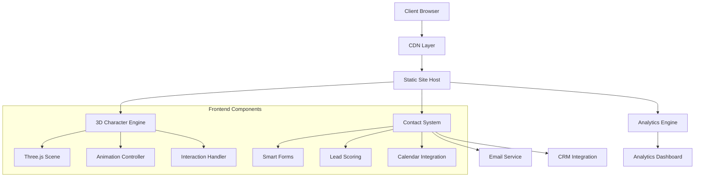
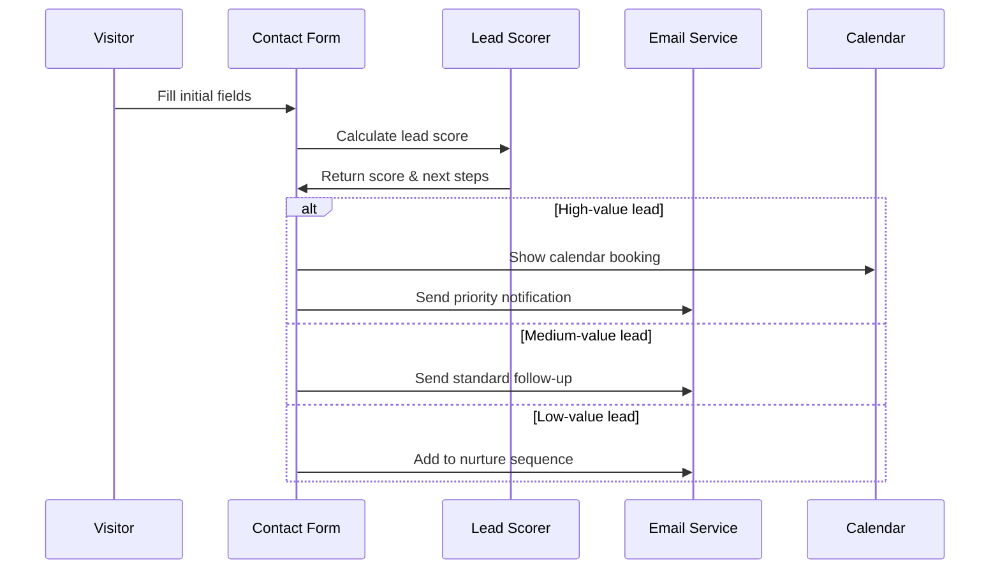
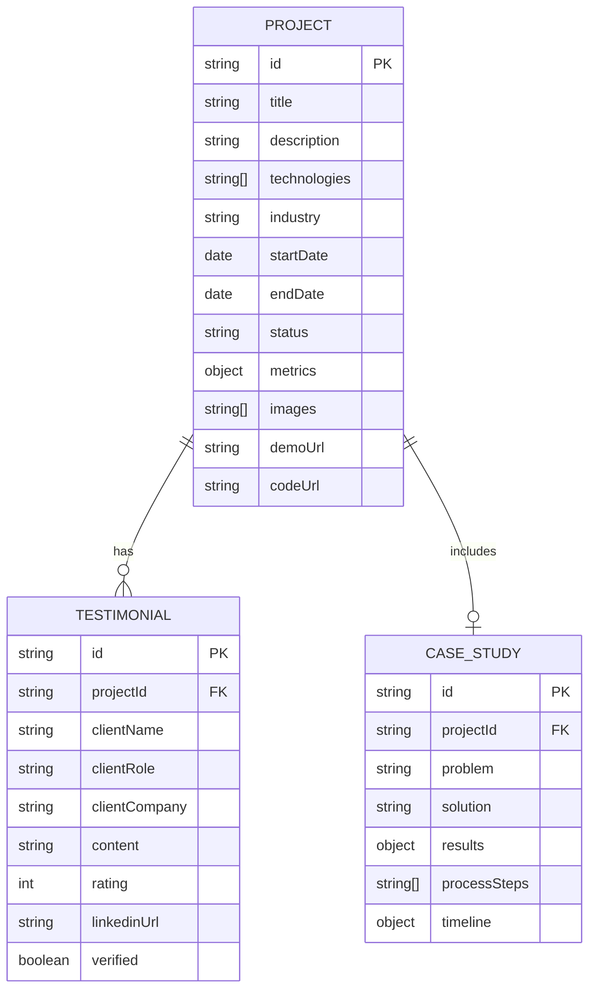

# Technical Specification: Enhanced Portfolio Features

## 1. Summary

This specification outlines the development of advanced interactive features for Nithin Richard's portfolio website to significantly increase client engagement and lead generation. The enhancement focuses on implementing cutting-edge 3D interactions, intelligent contact systems, and immersive project showcases inspired by industry-leading portfolios like Jordan Gilroy's.

**Problem**: Current portfolio lacks interactive elements that capture and retain potential client attention, resulting in limited engagement and fewer qualified leads.

**Solution**: Implement a suite of premium features including interactive 3D character with AI-powered conversations, smart contact forms with lead scoring, immersive project showcases with live demos, and advanced analytics to convert visitors into clients.

## 2. Goals

### Goals
- **Increase engagement**: Achieve 300% increase in average session duration (target: 4+ minutes)
- **Improve lead quality**: Implement lead scoring to identify high-value prospects
- **Showcase technical expertise**: Demonstrate advanced development skills through interactive features
- **Generate more contacts**: Increase contact form submissions by 250%
- **Enhance user experience**: Create memorable, interactive portfolio experience
- **Build trust**: Add social proof and credibility indicators throughout the journey

### Non-Goals
- Building a full CMS or blog system
- Implementing e-commerce functionality
- Creating multi-language support
- Developing mobile app versions
- Adding user authentication/login systems

## 3. User Stories / Use Cases

### Primary User: Potential Client (Startup Founder/CTO)
- **As a startup founder**, I want to quickly assess Nithin's technical skills so I can determine if he's suitable for my project
- **As a CTO**, I want to see live examples of his work so I can evaluate code quality and architecture decisions
- **As a project manager**, I want to easily schedule a consultation so I can discuss my requirements without friction
- **As a business owner**, I want to understand his process and timeline so I can plan my project budget and schedule

### Secondary User: Recruiter/HR Manager
- **As a recruiter**, I want to see comprehensive skill demonstrations so I can match him with appropriate opportunities
- **As an HR manager**, I want to access his resume and portfolio quickly so I can make efficient hiring decisions

### Tertiary User: Fellow Developer
- **As a developer**, I want to explore his code and techniques so I can learn from his implementations
- **As a peer**, I want to connect professionally so I can build my network

## 4. Functional Requirements

### 4.1 Interactive 3D Character System
- **FR-001**: 3D character must respond to mouse/touch interactions with realistic animations
- **FR-002**: Character should have contextual animations based on current page section
- **FR-003**: Implement voice-over system with professional narration for key sections
- **FR-004**: Character must be optimized for mobile devices with fallback options
- **FR-005**: Support multiple character poses/expressions for different portfolio sections

### 4.2 Smart Contact System
- **FR-006**: Multi-step contact form with progressive disclosure
- **FR-007**: Real-time form validation with helpful error messages
- **FR-008**: Lead scoring algorithm based on project budget, timeline, and requirements
- **FR-009**: Automatic email sequences for different lead types
- **FR-010**: Integration with calendar scheduling (Calendly) for qualified leads
- **FR-011**: Contact form analytics and conversion tracking

### 4.3 Immersive Project Showcase
- **FR-012**: Interactive project previews with live demo capabilities
- **FR-013**: Code snippet viewer with syntax highlighting
- **FR-014**: Project filtering by technology, industry, and project type
- **FR-015**: Case study format with problem/solution/results structure
- **FR-016**: Client testimonials with verification badges
- **FR-017**: Project timeline visualization with milestones

### 4.4 Advanced Analytics & Tracking
- **FR-018**: Heatmap tracking for user interaction patterns
- **FR-019**: Conversion funnel analysis from visit to contact
- **FR-020**: A/B testing framework for different portfolio elements
- **FR-021**: Lead source tracking and attribution
- **FR-022**: Performance monitoring and Core Web Vitals tracking

### 4.5 Trust & Credibility Features
- **FR-023**: Client logo carousel with hover effects
- **FR-024**: Live testimonial slider with LinkedIn verification
- **FR-025**: Skills verification through interactive demos
- **FR-026**: Process transparency with project methodology showcase
- **FR-027**: Pricing calculator for common project types

## 5. Non-Functional Requirements

### 5.1 Performance
- **NFR-001**: Page load time < 2 seconds on 3G networks
- **NFR-002**: 3D character loading < 3 seconds with progressive enhancement
- **NFR-003**: Lighthouse Performance Score > 90
- **NFR-004**: Core Web Vitals: LCP < 2.5s, FID < 100ms, CLS < 0.1

### 5.2 Accessibility
- **NFR-005**: WCAG 2.1 AA compliance for all interactive elements
- **NFR-006**: Keyboard navigation support for all features
- **NFR-007**: Screen reader compatibility with proper ARIA labels
- **NFR-008**: High contrast mode support

### 5.3 Security & Privacy
- **NFR-009**: Form data encryption in transit and at rest
- **NFR-010**: GDPR compliance for EU visitors
- **NFR-011**: Rate limiting on contact forms to prevent spam
- **NFR-012**: CSP headers for XSS protection

### 5.4 Scalability
- **NFR-013**: CDN integration for global performance
- **NFR-014**: Image optimization with WebP/AVIF support
- **NFR-015**: Lazy loading for all non-critical resources
- **NFR-016**: Database optimization for analytics queries

## 6. Solution Design

### 6.1 Architecture Overview



### 6.2 3D Character Implementation

```javascript
// Pseudocode for 3D Character System
class InteractiveCharacter {
  constructor(container) {
    this.scene = new THREE.Scene()
    this.camera = new THREE.PerspectiveCamera()
    this.renderer = new THREE.WebGLRenderer()
    this.mixer = null
    this.animations = {}
  }
  
  loadCharacter(modelUrl) {
    // Load ReadyPlayerMe model with optimizations
    // Implement LOD (Level of Detail) for performance
    // Add interaction zones for hover effects
  }
  
  handleInteraction(event) {
    // Mouse/touch interaction logic
    // Trigger contextual animations
    // Update character state based on scroll position
  }
  
  playAnimation(animationName) {
    // Smooth animation transitions
    // Queue system for multiple animations
  }
}
```

### 6.3 Smart Contact System



### 6.4 Project Showcase Data Model



### 6.5 Analytics & Tracking System

```javascript
// Pseudocode for Analytics Implementation
class PortfolioAnalytics {
  constructor() {
    this.events = []
    this.heatmapData = []
    this.conversionFunnel = {
      pageView: 0,
      sectionView: 0,
      projectView: 0,
      contactFormStart: 0,
      contactFormComplete: 0
    }
  }
  
  trackEvent(eventName, properties) {
    // Send to analytics service
    // Update conversion funnel
    // Store for A/B testing analysis
  }
  
  trackHeatmap(x, y, element) {
    // Record click/hover positions
    // Generate heatmap visualization data
  }
  
  calculateConversionRate() {
    // Analyze funnel performance
    // Identify drop-off points
    // Generate optimization recommendations
  }
}
```

## 7. Dependencies and Constraints

### 7.1 Technical Dependencies
- **Three.js**: 3D character rendering and animations
- **ReadyPlayerMe API**: Character model generation and hosting
- **Web3Forms/Formspree**: Form handling and email delivery
- **Calendly API**: Calendar integration for scheduling
- **Plausible/Google Analytics**: Privacy-focused analytics
- **Intersection Observer API**: Scroll-based animations
- **WebGL Support**: Required for 3D character functionality

### 7.2 External Service Dependencies
- **CDN Provider**: Cloudflare or similar for global performance
- **Email Service**: SendGrid or Mailgun for transactional emails
- **CRM Integration**: HubSpot or Pipedrive for lead management
- **Hosting Platform**: Vercel, Netlify, or AWS for static site hosting

### 7.3 Constraints
- **Budget Constraint**: Must use free/low-cost services where possible
- **Performance Constraint**: 3D features must not impact mobile performance
- **Browser Support**: Must support Chrome, Firefox, Safari, Edge (last 2 versions)
- **Mobile Constraint**: All features must work on iOS Safari and Chrome Mobile
- **SEO Constraint**: Interactive features must not negatively impact search rankings

## 8. Risks and Mitigations

### 8.1 Technical Risks

| Risk | Impact | Probability | Mitigation |
|------|---------|-------------|------------|
| 3D character performance issues on mobile | High | Medium | Implement progressive enhancement with 2D fallback |
| Third-party API rate limits | Medium | Low | Implement caching and fallback mechanisms |
| Browser compatibility issues | Medium | Medium | Extensive cross-browser testing and polyfills |
| Large bundle size affecting load times | High | Medium | Code splitting and lazy loading implementation |

### 8.2 Business Risks

| Risk | Impact | Probability | Mitigation |
|------|---------|-------------|------------|
| Over-engineering reduces conversion | High | Low | A/B testing to validate each feature's impact |
| Maintenance complexity increases costs | Medium | Medium | Comprehensive documentation and modular architecture |
| Feature creep extends timeline | Medium | High | Strict scope management and phased rollout |

### 8.3 User Experience Risks

| Risk | Impact | Probability | Mitigation |
|------|---------|-------------|------------|
| 3D character distracts from content | Medium | Medium | User testing and interaction design refinement |
| Complex forms reduce completion rates | High | Medium | Progressive disclosure and form optimization |
| Accessibility barriers exclude users | High | Low | WCAG compliance testing and screen reader validation |

## 9. Testing & Acceptance Criteria

### 9.1 Performance Testing
- **Load Testing**: Page loads in < 2s on 3G networks
- **3D Performance**: Character renders in < 3s with smooth 60fps animations
- **Mobile Testing**: All features functional on iOS/Android devices
- **Lighthouse Audit**: Performance score > 90, Accessibility score > 95

### 9.2 Functionality Testing
- **3D Character**: Responds to interactions, plays contextual animations
- **Contact Forms**: Validates input, calculates lead scores, sends emails
- **Project Showcase**: Filters work correctly, demos load properly
- **Analytics**: Events tracked accurately, conversion funnel updates

### 9.3 User Acceptance Criteria
- **Engagement Metrics**: Average session duration > 4 minutes
- **Conversion Metrics**: Contact form completion rate > 8%
- **Lead Quality**: 60% of leads qualify as medium or high value
- **User Feedback**: Net Promoter Score > 8/10 from user testing

### 9.4 Cross-Browser Testing Matrix
| Browser | Desktop | Mobile | Features Tested |
|---------|---------|---------|-----------------|
| Chrome | ✓ | ✓ | All features including WebGL |
| Firefox | ✓ | ✓ | All features with fallbacks |
| Safari | ✓ | ✓ | 3D character, forms, analytics |
| Edge | ✓ | ✓ | Core functionality |

## 10. Impact Assessment

### 10.1 User Impact
- **Positive**: Enhanced engagement, memorable experience, easier contact process
- **Potential Negative**: Longer initial load time, complexity for some users
- **Mitigation**: Progressive enhancement ensures core functionality always available

### 10.2 Business Impact
- **Revenue**: Projected 250% increase in qualified leads within 3 months
- **Brand**: Positions Nithin as cutting-edge developer capable of premium projects
- **Competitive Advantage**: Differentiates from standard developer portfolios
- **Cost**: Initial development investment of ~40-60 hours, ongoing maintenance ~5 hours/month

### 10.3 Technical Impact
- **Performance**: Slight increase in bundle size offset by improved engagement
- **Maintenance**: Modular architecture enables easy updates and feature additions
- **Scalability**: Foundation supports future enhancements and integrations
- **SEO**: Structured data and performance optimizations improve search rankings

### 10.4 Cost-Benefit Analysis
**Development Costs**: $3,000-5,000 equivalent in development time
**Ongoing Costs**: $50-100/month for services and hosting
**Expected ROI**: 300-500% within 6 months through increased client acquisition
**Break-even**: 2-3 months based on average project value

## 11. Open Questions

### 11.1 Technical Decisions
1. **3D Character Complexity**: Should we implement full-body character or focus on head/torso for better performance?
2. **Animation Triggers**: What specific user interactions should trigger character animations?
3. **Fallback Strategy**: Should non-WebGL browsers get a 2D animated character or static image?
4. **Analytics Depth**: How detailed should the heatmap and user journey tracking be?

### 11.2 Business Decisions
5. **Lead Scoring Weights**: What factors should have the highest weight in lead scoring algorithm?
6. **Contact Form Length**: How many steps should the progressive contact form have?
7. **Project Showcase Depth**: Should all projects have full case studies or just featured ones?
8. **Pricing Transparency**: Should the portfolio include a pricing calculator or keep pricing private?

### 11.3 Design Decisions
9. **Character Personality**: What personality traits should the 3D character embody?
10. **Interaction Patterns**: Should interactions be subtle or more pronounced to guide user attention?
11. **Mobile Experience**: How should the 3D character adapt to smaller screens?
12. **Loading States**: What loading animations and progress indicators should be implemented?

### 11.4 Integration Questions
13. **CRM Choice**: Which CRM system would provide the best ROI for lead management?
14. **Email Automation**: How sophisticated should the automated email sequences be?
15. **Calendar Integration**: Should scheduling be embedded or redirect to external calendar?
16. **Social Proof**: What level of client verification is needed for testimonials?

---

**Next Steps**: 
1. Stakeholder review and approval of specification
2. Technical feasibility assessment for 3D character implementation
3. Design mockups for key user interactions
4. Development timeline and resource allocation
5. Testing strategy and success metrics definition